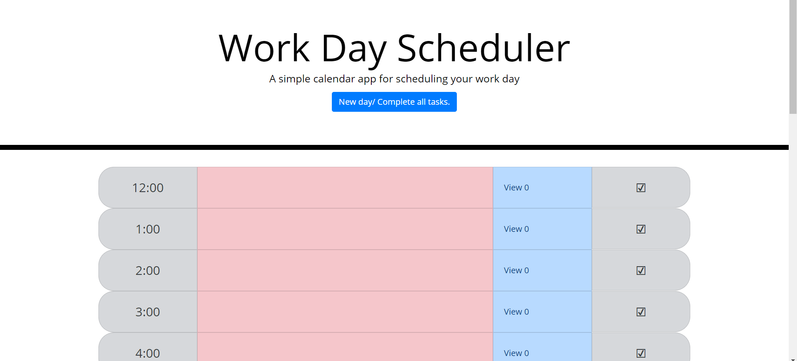

# homework-5

This was created in order to complete an assignment for coding boot camp.

The goal of this webpage is to provide the user with a daily calendar that he/she can use to keep track of the upcoming events for the day.  Some features pf the calendar 

i) Any time that has past during the day will have its input slot displayed in red.
ii) The current hour's input slot will be displayed white.
iii) Future hours' input slots will be dipslayed in blue.
iv) If the user types anything into the input and hits enter or clicks the check button, the input will be saved as a "to do" for the selected hour and saved to the local storage.
v) The user will see the last input event as a placeholder for any given hour.
vi) if the user clicks on the view button, it will display and unordered list of "to dos" for the hour in a modal.
vii)  Within this modal, the user can use the complete buttons to individually remove tasks.
viii) The total number of "to dos" for an hour will be shown on the view button.
ix) If there is anything to do in a given hour, the view button will appear yellow.
x) The user can clear all "to dos" by clicking the complete all/ new day button at the top of the page.

The deployed webpage is available [here](https://jalbert12485.github.io/daily-calendar/), and a screenshot is below.
